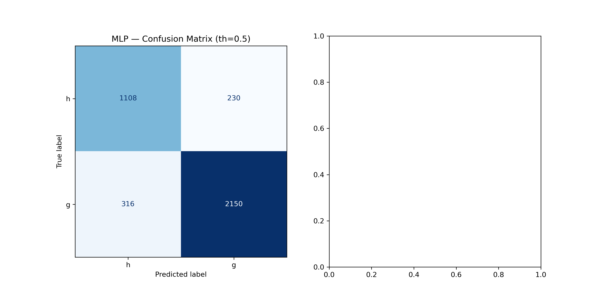
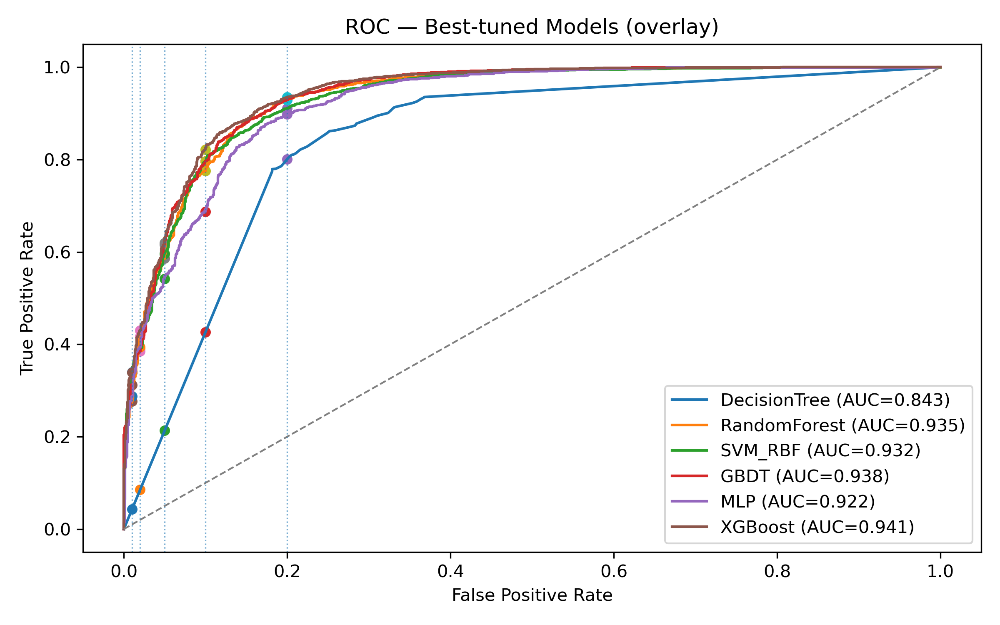

# Gamma-Hadron-Separation-with-Machine-Learning
Gamma-Hadron Separation with Machine Learning

Here’s a **ready-to-use GitHub README** draft summarizing your full workflow, steps, and usage.
It’s formatted for Markdown rendering in GitHub, with collapsible sections for clarity and an option to view confusion matrix and ROC plots.

---

# MAGIC Gamma–Hadron Classification (Low-FPR Machine Learning Suite)

This repository provides a **machine learning framework** to classify **gamma-ray (signal)** vs. **hadronic (background)** events from the **MAGIC dataset**, emphasizing **low false-positive rate (FPR)** performance.
It supports multiple models, feature-processing variants, and automatic evaluation with confusion matrices and ROC-based metrics.

---

## 🔍 Overview

Gamma–hadron separation is a key task in ground-based Cherenkov telescope analysis.
Simple accuracy is insufficient — **classifying a background event as signal is far worse** than misclassifying signal as background.
Thus, models here are compared using **ROC-based metrics**, particularly **TPR at low FPRs** (e.g., 1–10%) and **partial AUC (pAUC)**.

---

## ⚙️ Pipeline Summary

The full pipeline consists of standardized preprocessing, PCA-based feature compression, upsampling for class balance, and low-FPR model evaluation.

### Step 1 — Baseline: All Features → StandardScaler

* All original features (`fLength` → `fDist`) are standardized using `StandardScaler`.
* Models are trained directly on these standardized features.
* Evaluation focuses on:

  * **Partial AUC (pAUC@≤0.10)** as the CV selection metric
  * **TPR at FPR = 0.01, 0.02, 0.05, 0.10, 0.20**
  * **Full AUC**, **Confusion Matrix**, and **ROC plots**

### Step 2 — PCA Features (Top MI Feature + 95% Variance PCs)

* Compute **Mutual Information (MI)** between each feature and the target.
* Retain the **top MI feature (`fAlpha`)** explicitly.
* Apply `StandardScaler` to the remaining features, then fit **PCA** to keep components explaining **≈95% of variance**.
* Concatenate `[fAlpha (scaled)] + [PCA components]` to form the final training matrix.
* Train the same set of models with identical evaluation metrics.

### Step 3 — Model Training and Evaluation

* Upsample the minority class in the training data using `sklearn.utils.resample`.
* Perform **5-fold Stratified Cross-Validation** with **RandomizedSearchCV**.
* Optimize models for **pAUC@≤0.10**.
* Compute test-set metrics:

  * TPR@FPR thresholds (0.01–0.20)
  * Partial AUCs and Full AUC
  * Confusion Matrix and ROC plots (saved and/or displayed)
* Generate a **summary table** ranking all models by CV and test performance.

---

## 🧠 Models Supported

| Model                    | Description                              |
| ------------------------ | ---------------------------------------- |
| Decision Tree            | Simple, interpretable baseline           |
| Random Forest            | Bagging ensemble of decision trees       |
| RBF-SVM                  | Nonlinear kernel classifier              |
| Gradient Boosting (GBDT) | Boosted tree ensemble                    |
| MLP                      | Feed-forward neural network              |
| XGBoost                  | High-performance gradient boosting model |

---

## 📊 Outputs and Visualization

During each experiment, the following are automatically produced for every trained model:

* ✅ **Confusion Matrix (test set)**
  Shows true/false positive and negative predictions for threshold=0.5.

* ✅ **ROC Curve (test set)**
  Includes annotations of `TPR=..., @FPR=...` at target FPR thresholds.

* ✅ **All-Models ROC Overlay**
  A combined ROC comparison for all tuned models.

### 📁 Saved Files

All plots are stored in a `/plots/` (or `/plots1/`) directory:

| File                           | Description                        |
| ------------------------------ | ---------------------------------- |
| `ModelName_test_confusion.png` | Confusion matrix for test data     |
| `ModelName_test_roc.png`       | ROC curve with TPR@FPR markers     |
| `all_models_test_roc.png`      | Combined ROC overlay across models |

> **Tip:** You can control saving and display by setting in your class instance:
> `save_plots=True/False` and `show_plots=True/False`.

---

## 🧩 Example Usage

```python
suite = ROCFocusedClassifierSuite(
    X_train, y_train, X_test, y_test,
    positive_label="g",
    n_iter=10, cv_splits=5,
    random_state=42, verbose=1,
    save_plots=True, plots_dir="plots"
)

summary_df = suite.run_and_report()
```

---

## 🧾 Evaluation Metrics

| Metric            | Description                                                   |
| ----------------- | ------------------------------------------------------------- |
| **TPR@FPR=x%**    | True Positive Rate at specific False Positive Rate thresholds |
| **pAUC@≤x%**      | Partial ROC Area under FPR ≤ x%                               |
| **CV pAUC@≤0.10** | Used as model-selection score during cross-validation         |
| **AUC (full)**    | Full ROC area, included for reference                         |

---

## 🎯 Goal

To develop a reproducible framework for **low-FPR classification** on astrophysical data — comparing models and preprocessing strategies in a unified ROC-based evaluation system.

> Ultimately, this enables better **background rejection** and **signal purity**, key for high-energy astrophysics instruments like MAGIC, VERITAS, or COSI.

---

## 📎 Optional: Add Confusion Matrix & ROC Images

To showcase your actual outputs in the README (GitHub renders them nicely), insert image links like:

```markdown
### Example Outputs

#### Confusion Matrix (MLP)


#### ROC Curve (MLP)


#### ROC Overlay (All Models)

```

You can adjust image paths and file names according to your experiment folder structure.

---

## 🧪 Dependencies

Install required packages:

```bash
pip install numpy pandas scikit-learn matplotlib xgboost tabulate
```

---

## 📚 Citation / Acknowledgment

If you use this repository for research or presentations, please credit:

